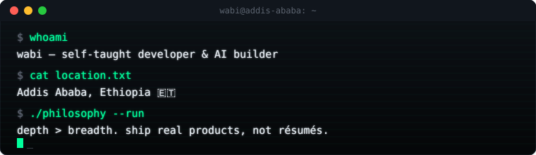

<div align="center">
  
</div>

<br/>

```
$ cat ./bio.md
```

I'm **Wabi** — a self-taught developer and AI builder working out of Addis Ababa.
I don't optimize for credentials; I optimize for shipped, working things with
real users. Most of what's below exists because I needed it to, not because
a course told me to build it.

Background in competitive cybersecurity (national semifinalist, INSA Cyber
Talent) — I still think in terms of attack surface even when I'm building
product, not breaking things.

<br/>

```
$ ls ./projects
```

**Lumiq AI** — `react-native` `expo` `ai`
A mobile learning app for Ethiopian national exam students. Spaced-repetition
push notifications, a full streak/retention system, and a viral share loop
built from scratch with deep-link referrals — no third-party growth SDK.

**Warden CI** — `github-app` `security` `supply-chain`
Live on the GitHub Marketplace. Scans pull request diffs for hardcoded
secrets (entropy-based, not regex guessing), hallucinated npm packages, and
dangerous dynamic execution. Built the whole scanning pipeline — parser,
detectors, orchestration — from the ground up.

**AfriVoice** — `in progress`
More soon.

<br/>

```
$ ./skills --list
```

`TypeScript` `React Native` `Node.js` `Python` `GitHub Actions CI/CD`
`AppSec / red-team basics` `OSINT` `AI infra & tooling`

<br/>

```
$ cat ./status.txt
```

Currently chasing international opportunities — UWC, ALA, scholarships,
internships — while keeping the products running. If you're building
something in AI infra or security tooling, my inbox is open.

<br/>

<div align="center">
<sub>terminal doesn't lie — check the commits.</sub>
</div>
